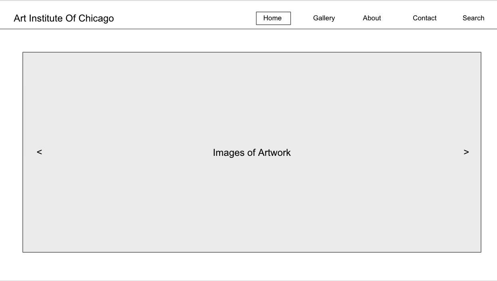

## Description:

The website I made is an online gallery walk-through of the Art Institute of Chicago. I was inspired by the artwork that is always showcased throughout the museum itself when I use to visit as a child. You are able to view certain artwork throughout the website that will give you details of the artist and the history of the art piece.

## Technologies Used:

- HTML
- CSS
- JavaScript
- React Library
- Netlify to deploy website

## Getting Started/Installation Instructions:

    1. Fork the repository
    2. Copy SSH link from the green button "Code"
    3. Clone down in the terminal within decided folder "git clone ...(ssh link)"
    4. CD into 'chicago-art-gallery'
    5. Type 'code .' (note the period is important)
    6. run "npm start" into terminal to bring up react web-browser to update what you are editing.
    7. Have Fun!

## Link to the Website

https://articjc.netlify.app/

## Actual Web Preview

## Wire Frame

## Contribution Guidelines:

You can submit an issue on the git-hub to address the issues and concerns you have with the file.

I also made a contribution.md so if you don't feel comfortable displaying yourself public you can do it anonymously!
